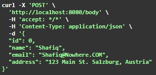
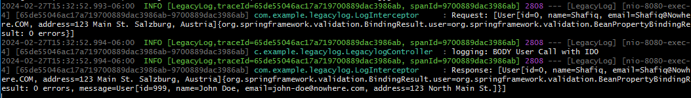

# Simple Request and Response Logger for Legacy MVC application

This example demonstrates how Request and Reponses for all Legacy Applications calls can be logged using Spring Boot.  Uses Spring AOP with AspectJ to create Logging Intercerpter.

If you would like to do API Logging, use the [Zero Log](https://github.com/smislam/zerolog/) solution.

## What does it build?
* Uses Message Diagnostic Context (MDC) to add UserId to all logs
* Uses Micrometer to Tracing data for each log
* Creates a LoggingInterceptor that will intercept all calls and get relevant data
* Uses OpenAPI UI (Swagger) to visualize and test the API endpoints

## Example of the log
  * 
  * 

## Next Steps
* Secure all API access using robust Authentication (OIDC)
* Consider log data storage capacity increase, data retention and archival options

### Reference Documentation
For further reference, please consider the following sections:

* [Official Apache Maven documentation](https://maven.apache.org/guides/index.html)
* [Spring Boot Maven Plugin Reference Guide](https://docs.spring.io/spring-boot/docs/3.2.3/maven-plugin/reference/html/)
* [Distributed Tracing Reference Guide](https://micrometer.io/docs/tracing)
* [Getting Started with Distributed Tracing](https://docs.spring.io/spring-boot/docs/3.2.3/reference/html/actuator.html#actuator.micrometer-tracing.getting-started)
* [Spring Web](https://docs.spring.io/spring-boot/docs/3.2.3/reference/htmlsingle/index.html#web)
* [Building a RESTful Web Service](https://spring.io/guides/gs/rest-service/)
* [Serving Web Content with Spring MVC](https://spring.io/guides/gs/serving-web-content/)
* [Building REST services with Spring](https://spring.io/guides/tutorials/rest/)
* [Building a RESTful Web Service with Spring Boot Actuator](https://spring.io/guides/gs/actuator-service/)

